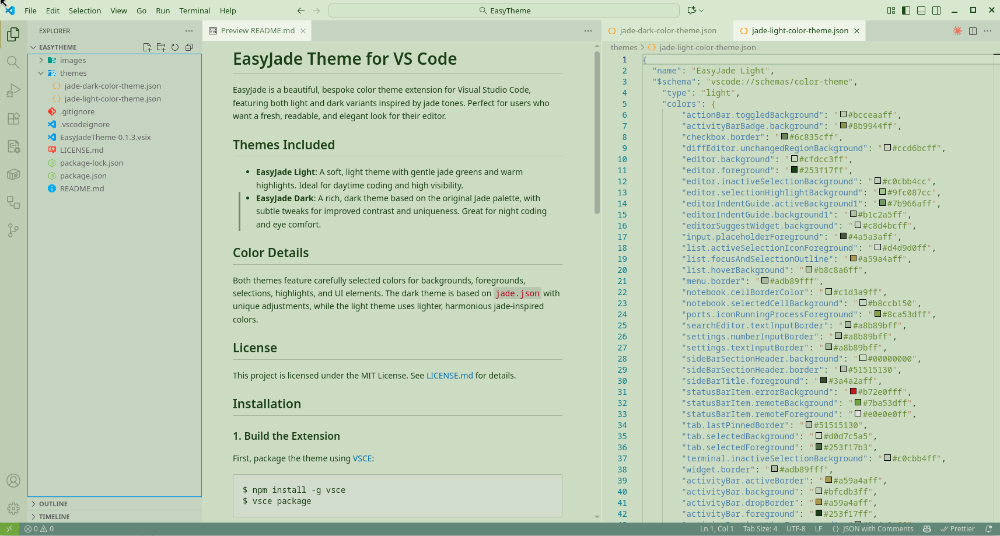
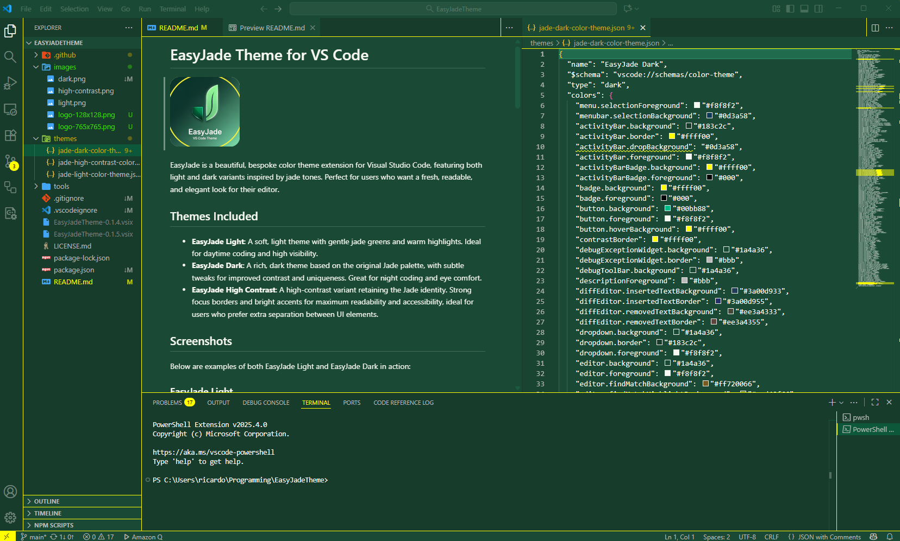

# EasyJade Theme for VS Code

EasyJade is a beautiful, bespoke color theme extension for Visual Studio Code, featuring both light and dark variants inspired by jade tones. Perfect for users who want a fresh, readable, and elegant look for their editor.

## Themes Included

- **EasyJade Light**: A soft, light theme with gentle jade greens and warm highlights. Ideal for daytime coding and high visibility.
- **EasyJade Dark**: A rich, dark theme based on the original Jade palette, with subtle tweaks for improved contrast and uniqueness. Great for night coding and eye comfort.


## Screenshots

Below are examples of both EasyJade Light and EasyJade Dark in action:

### EasyJade Light


### EasyJade Dark


## Color Details

Both themes feature carefully selected colors for backgrounds, foregrounds, selections, highlights, and UI elements. The dark theme is based on `jade.json` with unique adjustments, while the light theme uses lighter, harmonious jade-inspired colors.

## License

This project is licensed under the MIT License. See [LICENSE.md](./LICENSE.md) for details.

## Installation

### 1. Build the Extension

First, package the theme using [VSCE](https://code.visualstudio.com/api/working-with-extensions/publishing-extension):

```bash
$ npm install -g vsce
$ vsce package
```
This will create a `.vsix` file in your project directory.

### 2. Install Locally

Install the packaged theme in VS Code:

```bash
$ code --install-extension EasyJadeTheme-0.1.3.vsix
```

### 3. Activate the Theme

Open the Command Palette (`Ctrl+Shift+P`), type `Color Theme`, and select either **EasyJade Light** or **EasyJade Dark** from the list.

## Contributing

Feel free to fork, modify, and submit pull requests! For major changes, please open an issue first to discuss what you would like to change.

## Repository

[GitHub: gcclinux/EasyJadeTheme](https://github.com/gcclinux/EasyJadeTheme)

---

## *Support & Community*

[](https://github.com/gcclinux/EasyJadeTheme/issues)
[](https://github.com/gcclinux/EasyJadeTheme/discussions)
[](https://www.buymeacoffee.com/gcclinux)

Enjoy coding with EasyJade!
